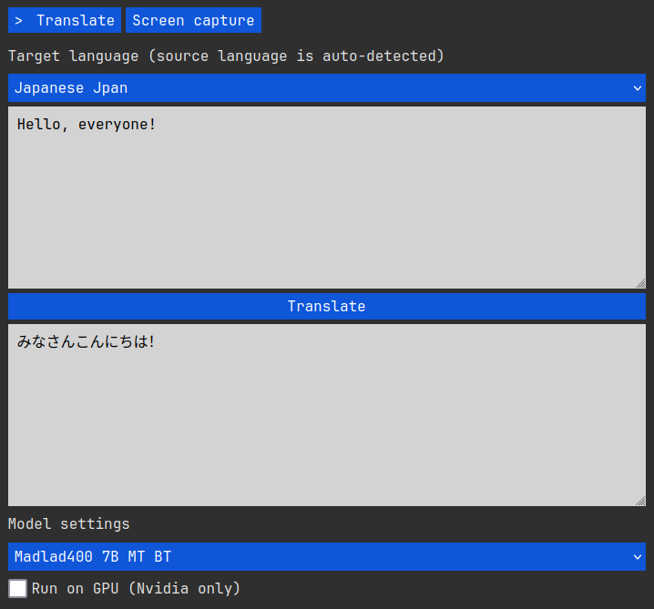

# EyeOfBabel

A simple utilitarian **self-hosted translation app** with the added ability to read text directly from images on the screen using a lightweight built-in **screen capture** tool. It also exposes the loaded model via a simple **http API** for use by developers and third-party apps. Built using [BrutalPyWebUI](https://github.com/zenoverflow/brutalpywebui).



## Platforms

-   **Linux (x64)**
-   **Windows (x64)**

## Features

-   Translate between **400 languages** using **Google's Madlad400 model**.
-   Read text in **83 languages** directly from your screen using the built-in **screen capture** tool and the [**EasyOCR**](https://github.com/JaidedAI/EasyOCR) backend.
-   Support for switching the screen reader to [**MangaOCR**](https://github.com/kha-white/manga-ocr), which, unlike the name would suggest, is actually very useful for reading Japanese text in a **wide** range of images that **EasyOCR** may or may not handle that well.
-   Start and stop the desktop reader module on-demand, separately from the translator.
-   Power-users and developers can use the loaded translation model via the built-in **json-based http API**.
-   **Linux** users can utilize modern **Nvidia GPUs** to run the translation models much faster.

## Setup (Windows)

-   Download the latest zip file for Windows from our [releases page](https://github.com/zenoverflow/eyeofbabel/releases).
-   Extract the contents in an empty folder of your choice.
-   Ensure port `11537` is free (it usually is).
-   Run `app.exe` by double clicking (or via CMD/Powershell if you want to set default parameters).
-   Wait for the initial model download to complete. A browser should automatically open when everything is loaded.
-   Use the web interface at `http://localhost:11537` and/or the **API** at `http://localhost:11537/api`.
-   To update, just download a new release, delete the old one, extract the new one, etc. The models are stored in the default global folder for each backend, so they won't need to be redownloaded.

## Setup (Linux)

-   Install the required system packages (Debian/Ubuntu example):

```bash
sudo apt update && sudo apt install -y git bash curl
```

-   Clone the repo:

```bash
git clone https://github.com/zenoverflow/eyeofbabel
```

-   Enter the folder:

```bash
cd eyeofbabel
```

-   Ensure port `11537` is free (it usually is) and run the startup script:

```bash
./start_linux.sh
```

-   Wait for the setup and initial model download to complete. A browser should automatically open when everything is loaded.
-   Use the web interface at `http://localhost:11537` and/or the **API** at `http://localhost:11537/api`.
-   To update directly from the repo (consider the main branch a stable release):

```bash
./update_linux.sh
```

## Runtime requirements

-   RAM/VRAM for the 3B model: ~3,5GB.
-   RAM/VRAM for the 7B model: ~8,5GB.
-   RAM/VRAM for the 10B model: ~10GB.
-   RAM for any reader model: ~1GB.
-   CPU: if running on CPU, the faster the better, has lower impact if running on GPU.
-   GPU (optional, recommended, Linux only): any Nvidia GPU with CUDA and compute capability over 3.5. If not sure, [check your GPU on this page](https://developer.nvidia.com/cuda-gpus). Most often your GPU will be in the section named "CUDA-Enabled NVIDIA Quadro and NVIDIA RTX".

## Usage notes

-   Use the **Translate** tab for translations and the **Screen capture** tab for configuring and starting (or stopping) the desktop reader.
-   Note that the reader (OCR) models are not capable of recognizing each and every font out there on the web. In other words, certain fonts will make them struggle and produce bad output or flat out refuse to work. This behavior is expected and is not a bug.
-   Models are downloaded to the standard global folders for HuggingFace / EasyOCR / MangaOCR.
-   All reader model downloads happen only once, so they can be used **offline** afterwards.
-   Model downloads can be tracked in the terminal.
-   The app runs the web interface on port `11537`. This port should be free on most systems. For power-users, you can set a different port using the usual `PORT` environment variable, or by running the executable from a terminal with the `--port` (or `-p`) parameter like `./start_linux.sh -p 3000` (or `.\app.exe -p 3000` on Windows).
-   On startup, the app loads the smallest model (3B) and runs it on CPU. You can change this with the `--model` (or `-m`) parameter and the `--nvidia` (or `-n`) parameter. For example, to load the 7B model on startup using GPU, you can run the executable from a terminal like `./start_linux.sh --nvidia -m 7` (or just `.\app.exe -m 7` on Windows where GPU is not supported). To load the 10B you use `-m 10`. Note that you can always change the model and device (CPU or GPU) at runtime via the web interface.
-   Windows users have noted that clicking inside the terminal can pause the app. This is actually a standard feature coming from Windows, and it is not a bug. The process can be unpaused by right-clicking or pressing Enter inside the terminal.
-   Do not run the Linux scripts from outside the folder, or everything will break.

## API example

```bash
curl -X POST -H "Content-Type: application/json" -d '{"text":"Guten Tag", "lang_to": "ja"}' http://localhost:11537/api
```

## Roadmap

-   Find out why Ctranslate2 cannot use GPU on Windows. Fix if possible.
-   Audio input (whispercpp?).
-   Fix bugs when found.
-   Sprinkle in some automated testing.
